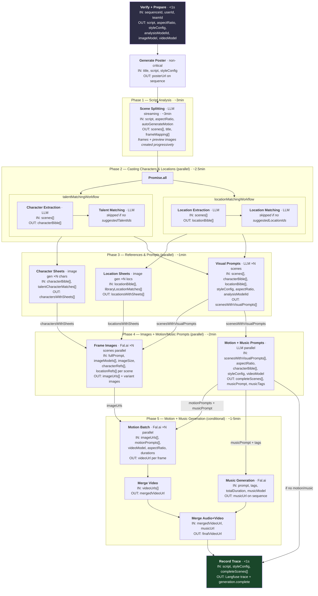
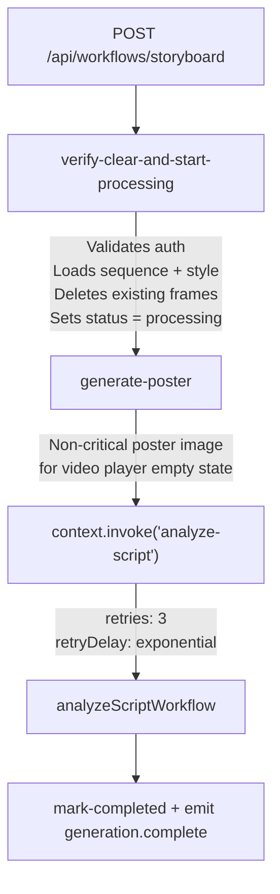
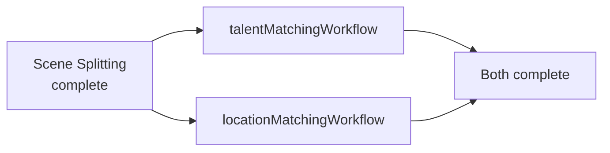
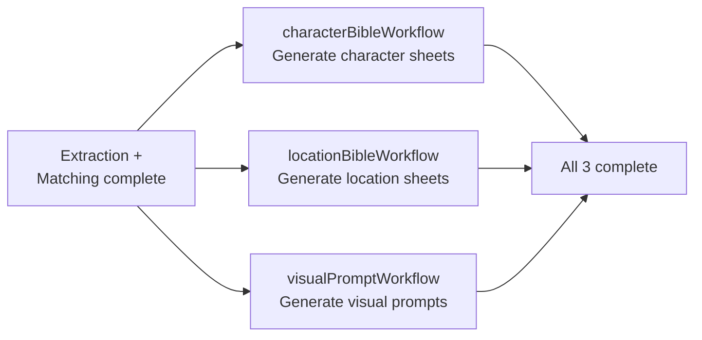
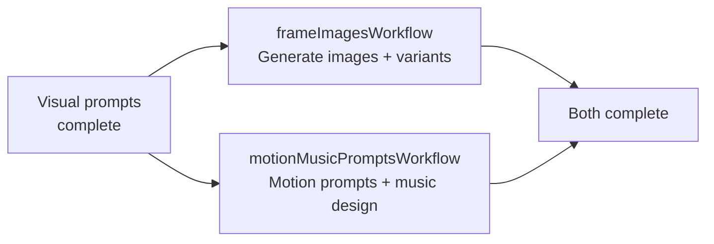
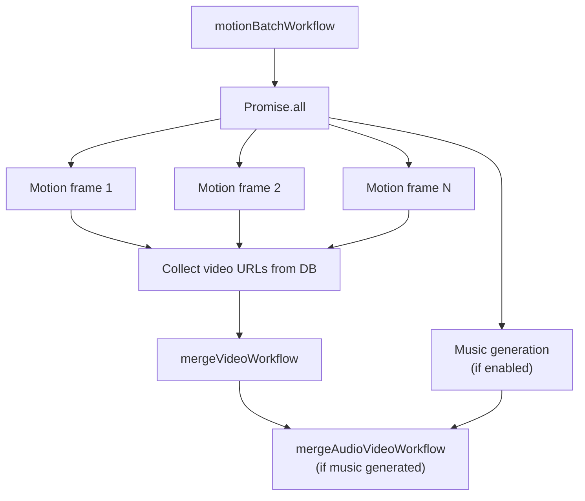
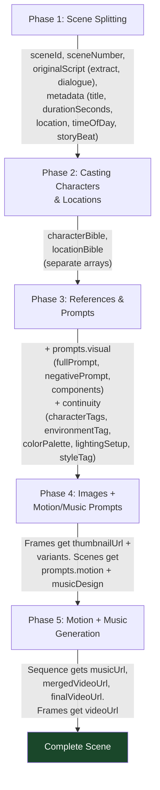

# Analyze Script Workflow

End-to-end pipeline that transforms a user's script into a complete storyboard with images, motion video, and music.

## High-Level Overview

> **Timing source:** Measured from local QStash logs for a 9-scene run. Phase 4 runs image generation and motion/music prompt generation in parallel, reducing wall-clock time significantly.

## Triggering Flow

The pipeline starts from server handlers in `src/functions/sequences.ts`:

1. **`createSequenceFn`** — Creates a new sequence record, then calls `triggerWorkflow('/storyboard', input)` via QStash
2. **`updateSequenceFn`** — If script, style, aspect ratio, or analysis model changed, triggers the same workflow
3. **`retryStoryboardFn`** — Retries a failed sequence (resets status to `processing`, re-triggers)

All three use `triggerWorkflow()` from `src/lib/workflow/client.ts`, which:

- Resolves the webhook URL (rewrites localhost to `host.docker.internal` for local dev)
- Calls `WorkflowClient.trigger()` with the URL `{baseUrl}/api/workflows/storyboard`
- Returns a `workflowRunId` for tracking

**Input shape (`StoryboardWorkflowInput`):**

| Field                  | Type      | Purpose                                      |
| ---------------------- | --------- | -------------------------------------------- |
| `userId`               | string    | Auth context                                 |
| `teamId`               | string    | Auth context                                 |
| `sequenceId`           | string    | Target sequence                              |
| `options`              | object    | `framesPerScene`, `generateThumbnails`, etc. |
| `autoGenerateMotion`   | boolean   | Whether to generate video for each frame     |
| `autoGenerateMusic`    | boolean   | Whether to generate music for the sequence   |
| `musicModel`           | string?   | Override music model                         |
| `imageModels`          | string[]? | Multiple image models for parallel gen       |
| `suggestedTalentIds`   | string[]? | Pre-selected talent for casting              |
| `suggestedLocationIds` | string[]? | Pre-selected locations for matching          |

## Storyboard Workflow

**File:** `src/lib/workflows/storyboard-workflow.ts`

The storyboard workflow validates data, generates a poster image, then delegates to the analyze-script workflow.

**Step: `verify-clear-and-start-processing`**

1. Validates auth via `validateSequenceAuth()`
2. Loads sequence with `getSequenceForUser()` — checks script and style exist
3. Loads and parses the style config
4. Deletes all existing frames for the sequence
5. Sets sequence status to `processing`
6. Returns resolved models: `analysisModelId`, `imageModel`, `videoModel`

**Step: `generate-poster`**

- Generates a poster image from the script+title+style for the video player empty state
- Non-critical — failures are logged and swallowed
- Emits `generation.poster:ready` with the URL

Then invokes `analyzeScriptWorkflow` with retries (3 attempts, exponential backoff).

After the analyze-script workflow completes, marks status as `completed` and emits `generation.complete`.

## Analyze Script Workflow — Phase-by-Phase

**File:** `src/lib/workflows/analyze-script-workflow.ts`

This is the core orchestration workflow. It uses `context.invoke()` for sub-workflows and `Promise.all()` for parallelism.

### Phase 1: Scene Splitting (Streaming LLM)

**Sub-workflow:** `sceneSplitWorkflow` (`src/lib/workflows/scene-split-workflow.ts`)

Uses streaming LLM output to create frames progressively as scenes arrive, plus triggers preview image generation for each scene.

**Steps:**

1. **`prepare-scene-splitting`** — Fetches the prompt template from Langfuse
2. **`scene-splitting-stream`** — Streams the LLM response through `createStreamingSceneParser()`:
   - Parses incremental JSON chunks via `partial-json`
   - On each complete scene: calls `upsertFrame()` to create/update the frame in DB, emits `generation.scene:new` and `generation.frame:created`
   - On title detection: updates the sequence title, emits `generation.updated`
   - **Preview images:** After each scene completes, triggers an image workflow (fire-and-forget via `triggerWorkflow`) using `PREVIEW_IMAGE_MODEL` for instant visual feedback
   - On `scene:updated` events: upserts frame with partial metadata as scenes stream in
3. **`reconcile-frames`** — Bulk upserts all frames via `bulkInsertFrames()` to handle QStash replay safety (idempotent on `sequenceId + orderIndex` conflict). Also emits `frame:created` for any frames missed during streaming.
4. **`deduct-llm-credits-scene-splitting`** — Credit deduction

- **Prompt:** `phase/scene-splitting-chat`
- **Variables:** `{ aspectRatio, script }` (script is sanitized)
- **Response schema:** `sceneSplittingResultSchema`
- **Output:** `{ scenes[], title, frameMapping[] }` — `frameMapping` is an array of `{ sceneId, frameId }` used throughout remaining phases

### Phase 2: Casting Characters & Locations (Parallel Sub-Workflows)

After scene splitting, two sub-workflows run **in parallel** via `Promise.all([context.invoke(...)])`:

**Talent Matching Workflow** (`src/lib/workflows/talent-matching-workflow.ts`):

1. **Character extraction** — `durableLLMCall('character-extraction')` with prompt `phase/character-extraction-chat`
   - Input: `{ scenes }` (JSON-serialized)
   - Output: `{ characterBible }` — array of characters with physical descriptions, clothing, consistency tags
2. **Talent matching** (skipped if no `suggestedTalentIds`):
   - Loads talent records from DB by IDs
   - LLM matches characters to talent
   - Deduplicates matches (each talent/character used once), emits `generation.talent:matched`
3. **Returns:** `{ characterBible, matches: talentCharacterMatches }`

**Location Matching Workflow** (`src/lib/workflows/location-matching-workflow.ts`):

1. **Location extraction** — `durableLLMCall('location-extraction')` with prompt `phase/location-extraction-chat`
   - Input: `{ scenes }` (JSON-serialized)
   - Output: `{ locationBible }` — array of locations with descriptions, architecture, color palettes
2. **Location matching** (skipped if no `suggestedLocationIds`):
   - Loads library locations from DB by IDs
   - LLM matches locations to library entries (requires confidence >= 0.5)
   - Deduplicates matches, emits `generation.location:matched`
3. **Returns:** `{ locationBible, matches: libraryLocationMatches }`

### Phase 3: References & Prompts (Parallel Sub-Workflows)

Three sub-workflows invoked in parallel via `Promise.all([context.invoke(...)])`:

**Character Bible Workflow** (`src/lib/workflows/character-bible-workflow.ts`):

- Generates a reference sheet image for each character (parallel per character)
- Uses talent match images as reference when available
- Uploads sheets to R2 storage
- Creates `sequence_characters` DB records

**Location Bible Workflow** (`src/lib/workflows/location-bible-workflow.ts`):

- Inserts location records into DB from location bible
- Generates establishing-shot reference images for each location (parallel)
- Uses library location reference images when matched
- Uploads to R2 storage, updates DB

**Visual Prompt Workflow** (`src/lib/workflows/visual-prompt-workflow.ts`):

- Delegates to `visualPromptSceneWorkflow` per scene (parallel via `context.invoke`)
- Each scene gets an LLM call that generates a `fullPrompt`, `negativePrompt`, and `continuity` data (character tags, environment tag, color palette, lighting, style tag)
- Merges results back into scene objects

### Phase 4: Images + Motion/Music Prompts (Parallel)

This is the key parallelization — image generation and motion/music prompt generation run **simultaneously** since they have no dependency on each other.

**Frame Images Workflow** (`src/lib/workflows/frame-images-workflow.ts`):

1. Builds per-scene character and location reference maps
2. For each scene, generates images with each selected model in parallel:
   - Invokes `generateImageWorkflow` per scene per model (retries: 3, exponential backoff)
   - After each image completes, invokes `generateVariantWorkflow` for shot grid variants
3. Returns `{ imageUrls }` — primary model's URL per scene

**Motion + Music Prompts Workflow** (`src/lib/workflows/motion-music-prompts-workflow.ts`):

1. **Snap durations** — Snaps scene durations to video model capabilities upfront so both motion prompts and music design see identical values
2. **Parallel generation** — Motion prompts and music design run simultaneously:
   - `motionPromptWorkflow` — Per-scene LLM calls for camera movement, motion style, timing
   - `generateMusicPromptWorkflow` — Single LLM call classifying per-scene music requirements + generating unified prompt with tags
3. **Merge** — Combines motion prompts and music design into `completeScenes[]`
4. **Returns:** `{ completeScenes, musicPrompt, musicTags }`

### Phase 5: Motion + Music Generation (Conditional)

**Sub-workflow:** `motionBatchWorkflow` (`src/lib/workflows/motion-batch-workflow.ts`)

Only runs if `autoGenerateMotion` is enabled, a video model is set, and images were generated. A single orchestrator handles:

1. **Parallel generation** — All frame motion workflows + optional music workflow invoked simultaneously
2. **Collect video URLs** — Reads from DB (authoritative ordering by `orderIndex`)
3. **Merge video** — Concatenates all frame videos into one sequence video
4. **Merge audio+video** — If music was generated, muxes audio onto the merged video

### Final: Record Trace + Return

**Step:** `record-workflow-trace`

- Records a trace to Langfuse for observability (input script, style config, aspect ratio, complete scenes, timing)

Returns the `completeScenes` array.

## Data Flow: Scene Object Accumulation

Each phase enriches the `Scene` object. The frame's `metadata` column is updated after visual prompts to persist intermediate results. Phase 1 creates frames progressively during streaming and triggers preview images for instant feedback.

**Scene type fields** (from `src/lib/ai/scene-analysis.schema.ts`):

| Field            | Added By | Notes                                                                      |
| ---------------- | -------- | -------------------------------------------------------------------------- |
| `sceneId`        | Phase 1  | Required, unique                                                           |
| `sceneNumber`    | Phase 1  | Required, 1-indexed                                                        |
| `originalScript` | Phase 1  | `{ extract, dialogue }`                                                    |
| `metadata`       | Phase 1  | `{ title, durationSeconds, location, timeOfDay, storyBeat }`               |
| `prompts.visual` | Phase 3  | `{ fullPrompt, negativePrompt, components }`                               |
| `continuity`     | Phase 3  | `{ characterTags, environmentTag, colorPalette, lightingSetup, styleTag }` |
| `prompts.motion` | Phase 4  | `{ fullPrompt, components, parameters }`                                   |
| `musicDesign`    | Phase 4  | `{ presence, style, mood, atmosphere }`                                    |
| `sourceImageUrl` | Optional | URL of generated or uploaded source image                                  |

## Real-Time Events

Events emitted via Upstash Realtime on a per-sequence channel (`getGenerationChannel(sequenceId)`).

| Event                                 | When Emitted                                     | Payload                                                               |
| ------------------------------------- | ------------------------------------------------ | --------------------------------------------------------------------- |
| `generation.phase:start`              | Before each LLM call or generation phase         | `{ phase, phaseName }`                                                |
| `generation.phase:complete`           | After each phase completes                       | `{ phase }`                                                           |
| `generation.poster:ready`             | Storyboard workflow — after poster generated     | `{ posterUrl }`                                                       |
| `generation.scene:new`                | Phase 1 — progressively as scenes stream in      | `{ sceneId, sceneNumber, title, scriptExtract, durationSeconds }`     |
| `generation.scene:updated`            | Phase 1 — as scene metadata updates during stream| `{ sceneId, sceneNumber, title, scriptExtract, durationSeconds }`     |
| `generation.updated`                  | Phase 1 — after title detected in stream         | `{ title }`                                                           |
| `generation.frame:created`            | Phase 1 — progressively as frames are upserted   | `{ frameId, sceneId, orderIndex }`                                    |
| `generation.frame:updated`            | Phase 4 — after prompts written to DB            | `{ frameId, updateType, metadata }`                                   |
| `generation.talent:matched`           | Phase 2 — when talent matched to characters      | `{ matches: [{ characterId, characterName, talentId, talentName }] }` |
| `generation.talent:unmatched`         | Phase 2 — unused talent after matching           | `{ unusedTalentIds, unusedTalentNames }`                              |
| `generation.location:matched`         | Phase 2 — when locations matched to library      | `{ matches: [{ locationId, locationName, libraryLocationId, ... }] }` |
| `generation.image:progress`           | Image workflow — generating/completed/failed     | `{ frameId, status, thumbnailUrl? }`                                  |
| `generation.variant-image:progress`   | Variant workflow — generating/completed/failed   | `{ frameId, status, variantImageUrl? }`                               |
| `generation.video:progress`           | Motion workflow — generating/completed/failed    | `{ frameId, status, videoUrl? }`                                      |
| `generation.audio:progress`           | Music workflow — generating/completed/failed     | `{ status, audioUrl? }`                                               |
| `generation.character-sheet:progress` | Character bible — per character                  | `{ characterId, status, sheetImageUrl? }`                             |
| `generation.location-sheet:progress`  | Location bible — per location                    | `{ locationId, status, referenceImageUrl? }`                          |
| `generation.recast:start`             | Recast character — before regenerating frames    | `{ characterId, frameCount }`                                         |
| `generation.recast:complete`          | Recast character — all frames regenerated        | `{ characterId, successCount, failedCount }`                          |
| `generation.recast:failed`            | Recast character — on failure                    | `{ characterId, error }`                                              |
| `generation.recast-location:start`    | Recast location — before regenerating frames     | `{ locationId, frameCount }`                                          |
| `generation.recast-location:complete` | Recast location — all frames regenerated         | `{ locationId, successCount, failedCount }`                           |
| `generation.recast-location:failed`   | Recast location — on failure                     | `{ locationId, error }`                                               |
| `generation.error`                    | On non-fatal workflow error                      | `{ message, phase? }`                                                 |
| `generation.failed`                   | On workflow failure                              | `{ message }`                                                         |
| `generation.complete`                 | Storyboard workflow — after everything finishes  | `{ sequenceId }`                                                      |

## Error Handling

### Failure Function

The analyze-script workflow registers a `failureFunction` that:

1. Sanitizes the error via `sanitizeFailResponse()` — extracts inner errors from QStash wrapper patterns, maps known Cloudflare error codes (e.g., `1102` → "Worker exceeded memory limit"), and truncates messages over 500 characters
2. Updates sequence status to `'failed'` with the error message
3. Emits `generation.failed` with the sanitized error

Sub-workflows (image, motion, music, character bible, location bible, talent matching, location matching, frame-images, motion-batch) each have their own failure functions that update the relevant record's status to `'failed'`.

### Retry Strategy

| Level                              | Retries | Backoff                            |
| ---------------------------------- | ------- | ---------------------------------- |
| Storyboard invoking analyze-script | 3       | Exponential (`2^retried * 1000ms`) |
| Image generation per scene         | 3       | Exponential                        |
| Variant generation per scene       | 3       | Exponential                        |
| Motion generation per frame        | 3       | Exponential                        |
| Music generation                   | 3       | Exponential                        |
| Individual `context.run()` steps   | —       | Managed by QStash (automatic)      |

### QStash Durability

- Each `context.run()` step is checkpointed — if the server restarts mid-workflow, execution resumes from the last completed step
- `context.invoke()` creates a child workflow that runs independently with its own retries
- Flow control (`getFalFlowControl()`, `getLLMFlowControl()`) manages concurrency for external API calls

## Key Files Reference

| File                                                   | Purpose                                                   |
| ------------------------------------------------------ | --------------------------------------------------------- |
| `src/functions/sequences.ts`                           | Server functions that trigger the pipeline                |
| `src/lib/workflow/client.ts`                           | `triggerWorkflow()` — QStash integration                  |
| `src/routes/api/workflows/$.ts`                        | Workflow route registration (`serveMany`)                  |
| `src/lib/workflows/storyboard-workflow.ts`             | Wrapper: verify, clear, poster, invoke analyze-script     |
| `src/lib/workflows/analyze-script-workflow.ts`         | Core orchestration (phases 1-5)                           |
| `src/lib/workflows/scene-split-workflow.ts`            | Phase 1: streaming scene split + preview images           |
| `src/lib/workflows/constants.ts`                       | `getFalFlowControl()` / `getLLMFlowControl()`             |
| `src/lib/ai/streaming-scene-parser.ts`                 | Incremental JSON parser for streaming scene creation      |
| `src/lib/workflow/sanitize-fail-response.ts`           | Error message extraction from QStash failures             |
| `src/lib/db/helpers/frames.ts`                         | `upsertFrame()` / `bulkInsertFrames()` idempotent helpers |
| **Extraction + Matching**                              |                                                           |
| `src/lib/workflows/talent-matching-workflow.ts`        | Character extraction + talent matching sub-workflow        |
| `src/lib/workflows/location-matching-workflow.ts`      | Location extraction + location matching sub-workflow       |
| **Reference Generation**                               |                                                           |
| `src/lib/workflows/character-bible-workflow.ts`        | Character sheet generation (parallel per character)        |
| `src/lib/workflows/character-sheet-workflow.ts`        | Single character sheet image generation                    |
| `src/lib/workflows/location-bible-workflow.ts`         | Location sheet generation (parallel per location)          |
| `src/lib/workflows/location-sheet-workflow.ts`         | Single location reference image generation                 |
| **Prompt Generation**                                  |                                                           |
| `src/lib/workflows/visual-prompt-workflow.ts`          | Visual prompt sub-workflow (parallel per scene)             |
| `src/lib/workflows/visual-prompt-scene-workflow.ts`    | Per-scene visual prompt LLM call                           |
| `src/lib/workflows/motion-prompt-workflow.ts`          | Motion prompt sub-workflow (parallel per scene)             |
| `src/lib/workflows/motion-prompt-scene-workflow.ts`    | Per-scene motion prompt LLM call                           |
| `src/lib/workflows/motion-music-prompts-workflow.ts`   | Orchestrates motion + music prompts in parallel            |
| `src/lib/workflows/music-prompt-workflow.ts`           | Music design LLM call                                      |
| **Image Generation**                                   |                                                           |
| `src/lib/workflows/frame-images-workflow.ts`           | Orchestrates image + variant gen for all scenes            |
| `src/lib/workflows/image-workflow.ts`                  | Single image generation (Fal.ai)                           |
| `src/lib/workflows/variant-workflow.ts`                | Shot grid variant generation                               |
| **Motion + Music Generation**                          |                                                           |
| `src/lib/workflows/motion-batch-workflow.ts`           | Orchestrates motion + music + merge                        |
| `src/lib/workflows/motion-workflow.ts`                 | Single motion/video generation (Fal.ai)                    |
| `src/lib/workflows/music-workflow.ts`                  | Music generation (Fal.ai)                                  |
| `src/lib/workflows/merge-video-workflow.ts`            | Merge frame videos into sequence video                     |
| `src/lib/workflows/merge-audio-video-workflow.ts`      | Merge music audio with video                               |
| **Recasting + Regeneration**                           |                                                           |
| `src/lib/workflows/recast-character-workflow.ts`       | Recast a character and regenerate affected frames          |
| `src/lib/workflows/recast-location-workflow.ts`        | Recast a location and regenerate affected frames           |
| `src/lib/workflows/regenerate-frames-workflow.ts`      | Regenerate specific frames with new prompts                |
| **Schemas + Events**                                   |                                                           |
| `src/lib/realtime/index.ts`                            | Real-time event schema and channel helpers                 |
| `src/lib/ai/scene-analysis.schema.ts`                  | `Scene` type definition                                    |
| `src/lib/ai/response-schemas.ts`                       | `musicDesignResultSchema` and other LLM response schemas   |
